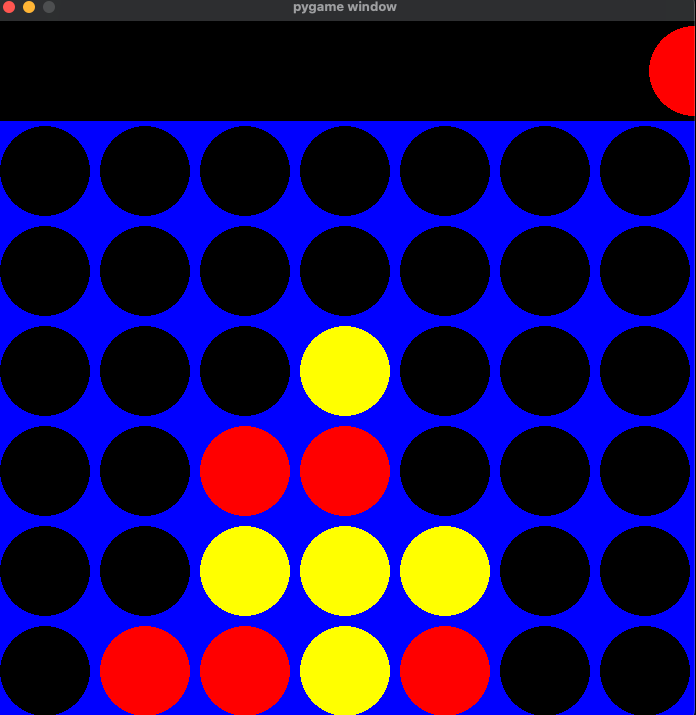

# Connect 4 Game in Python

This is a recreation of the classic Connect 4 game in Python. The Game alows the user to pick if they want to play with an AI or with 1 other human player via the terminal. The AI has 3 modes which the user can pick from: Easy, Medium, or Expert in terms of difficulty. The 3 modes of difficulty will be asked to the user via the terminal. The graphics of the game board is created using the Pygame library. 

## The Board
to begin the game use ```python3 start.py```command.

The terminal will prompt user what kind of game they would like to play and the user can enter their preference.


This is what the Connect 4 board looks like. The chip alternates automatically betweeen Red and Yellow colors to depict the 2 players in the game. In the AI version of the game, the yellow circle is AI and the red circle is the user.



When a player wins, this is how the board will be diplaying the message to the User. 


## How the AI levels are implemented  
### Easy AI
The easy level AI is implemented by generating a random number between 0 and 6 and the AI will make the move if the number genrated is available on the column. This AI mostly do not block the opposing player's move. 

### Expert AI
This version of the AI uses the Minimax algorithm which is used in decision-making and game theory. It tries to make the optimal moves using a scoring fucntion. At the start of the game, After the player first makes their move, (first turn between the human player and the AI player is randomized), the AI uses a scoring method and uses depth to  "look ahead" to calculate the best next move based on the current moves already made on the board.

# Resources
- [Similar Project idea](https://www.youtube.com/watch?v=UYgyRArKDEs&list=PLFCB5Dp81iNV_inzM-R9AKkZZlePCZdtV&index=1)
- [Minimax implentation in Connect 4](https://youtu.be/MMLtza3CZFM)
- [Minimax pseudocode](https://en.wikipedia.org/wiki/Minimax)
